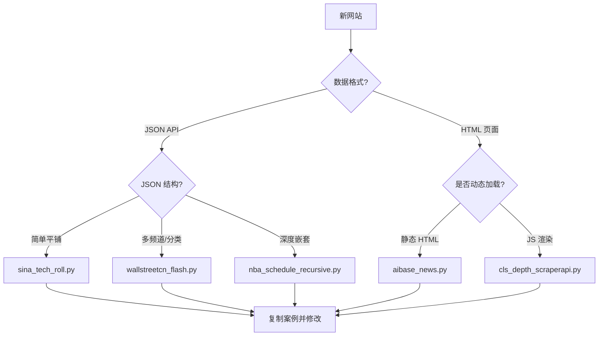

# 创建新闻源爬虫

## 概述
本 Skill 指导如何为新的新闻网站创建自定义爬虫 Provider，并提供**5个生产环境验证的成功案例**作为参考。

## 🎯 快速开始

### 决策流程



### 成功案例库

| 案例脚本 | 适用场景 | 条目数 | 关键技术 |
|---------|---------|--------|----------|
| [wallstreetcn_flash.py](examples/wallstreetcn_flash.py) | 多频道 API | 167+ | 轮询、去重、排序 |
| [sina_tech_roll.py](examples/sina_tech_roll.py) | 简单 JSON API | 100+ | 参数请求、时间戳 |
| [aibase_news.py](examples/aibase_news.py) | 静态 HTML | 24+ | BS4 + Regex |
| [cls_depth_scraperapi.py](examples/cls_depth_scraperapi.py) | ⚠️ 动态 JS 渲染 | 30+ | ScraperAPI |
| [nba_schedule_recursive.py](examples/nba_schedule_recursive.py) | 嵌套 JSON | 311+ | 递归遍历 |

📖 **详细说明**: 查看 [examples/README.md](examples/README.md)

---

## 📝 创建步骤

###  1. 分析目标网站

**检查清单**：
- [ ] 查看网络请求（Chrome DevTools → Network）
- [ ] 确定数据源：JSON API / HTML / 动态JS
- [ ] 记录所需字段：标题、URL、时间
- [ ] 检查是否需要登录或特殊请求头

### 2. 选择并复制案例

根据上面的决策流程图，选择最接近的案例脚本：

```bash
# 复制到剪贴板
cat .agent/skills/project/create-scraper/examples/sina_tech_roll.py
```

### 3. 编写爬虫代码

在 **Admin 后台 → 自定义源管理** 中创建，核心接口：

```python
def fetch(config, context):
    """
    Args:
        config (dict): 配置参数
        context (dict): 上下文 {
            'now': datetime,
            'use_scraperapi': bool,
            'platform_id': str,
            ...
        }
    
    Returns:
        list: [
            {
                "title": "标题",
                "url": "链接",
                "time": "2026-01-15 10:00",  # 可选
                "rank": 1,                    # 可选
                "published_at": 1705284000    # 可选(Unix时间戳)
            }
        ]
    """
    # 你的代码
    return items
```

### 4. 测试爬虫

在 Admin 后台点击 **"测试运行"** 验证输出：
- ✅ 返回列表格式
- ✅ 每个条目包含 `title` 和 `url`
- ✅ 时间格式正确
- ✅ 无异常错误

### 5. 清理测试脚本 ⚠️

> [!IMPORTANT]
> **测试完成后，务必删除项目根目录下的临时脚本！**

#### 方法一：自动检测并清理（推荐）

```bash
# 运行清理脚本，自动检测并提示删除
./scripts/cleanup_temp_scripts.sh
```

脚本会检测以下文件：
- `debug_*.py` - 调试脚本
- `scrape_*.py` - 临时爬虫脚本  
- `test_*.py` - 测试脚本

#### 方法二：手动清理

```bash
# 检查临时脚本
ls -la *.py | grep -E "debug_|scrape_|test_"

# 删除临时脚本  
rm debug_*.py scrape_*.py test_*.py
```

**最佳实践**：
- ✅ 直接在 Admin 后台编写和测试，无需本地文件
- ✅ 如需本地测试，使用 `/tmp/` 目录
- ✅ 使用一致的命名前缀（如 `temp_`, `debug_`）便于清理

### 6. 配置分类

将新源分配到合适的栏目分类（如"科技"、"财经"等）

---

## 🛠️ DynamicPyProvider 沙箱环境

### 可用模块（无需 import）

```python
# 直接使用以下全局变量
requests    # HTTP 请求
bs4         # BeautifulSoup（HTML 解析）
re          # 正则表达式
json        # JSON 处理
datetime    # 日期时间
time        # 时间工具
hashlib     # 哈希计算
etree       # xml.etree.ElementTree
```

### 特殊函数

#### `scraperapi_get()` - ScraperAPI 请求

用于绕过反爬虫和渲染 JavaScript：

```python
# 基础用法
resp = scraperapi_get(url, use_scraperapi=True)

# 渲染 JS（如 cls_depth 案例）
resp = scraperapi_get(
    url, 
    use_scraperapi=True,
    scraperapi_params={"render": "true", "country_code": "us"},
    timeout=60
)
```

**前提条件**：
1. Admin 后台开启"使用 ScraperAPI"
2. 设置环境变量 `SCRAPERAPI_KEY`

---

## 💡 实战技巧

### 时间格式处理

```python
# Unix 时间戳 → 字符串
import time
time_str = time.strftime("%Y-%m-%d %H:%M", time.localtime(1705284000))
# "2026-01-15 10:00"

# 字符串 → datetime
from datetime import datetime
dt = datetime.strptime("2026-01-15 10:00", "%Y-%m-%d %H:%M")
```

### 去重处理

```python
seen_ids = set()
for item in items:
    item_id = item.get("id")
    if item_id in seen_ids:
        continue
    seen_ids.add(item_id)
    results.append(item)
```

### 错误容错

```python
try:
    resp = requests.get(url, headers=headers, timeout=10)
    resp.raise_for_status()  # 检查 HTTP 状态码
except Exception as e:
    print(f"请求失败: {e}")
    return []  # 返回空列表，避免崩溃
```

### 递归遍历嵌套 JSON

参考 `nba_schedule_recursive.py`：

```python
stack = [data]
while stack:
    cur = stack.pop()
    if isinstance(cur, dict):
        if "目标字段" in cur:  # 识别目标对象
            results.append(cur)
        else:
            stack.extend(cur.values())
    elif isinstance(cur, list):
        stack.extend(cur)
```

---

## ⚠️ 常见陷阱

| 问题 | 原因 | 解决方案 |
|------|------|----------|
| 返回空列表 | URL 或参数错误 | 在浏览器中验证 API 响应 |
| 时间格式不对 | 未转换为标准格式 | 使用 `strftime()` 统一格式 |
| 编码错误 | 中文乱码 | 设置 `resp.encoding = 'utf-8'` |
| 超时 | 网络慢或反爬虫 | 增加 `timeout`，考虑 ScraperAPI |
| JS 动态内容抓不到 | 需要浏览器渲染 | 使用 `scraperapi_get()` + render |

---

## 📚 参考信息

- [成功案例详解](examples/README.md) - 5 个生产案例的技术要点
- [DynamicPyProvider 源码](../../hotnews/kernel/providers/dynamic_py.py) - 沙箱实现细节
