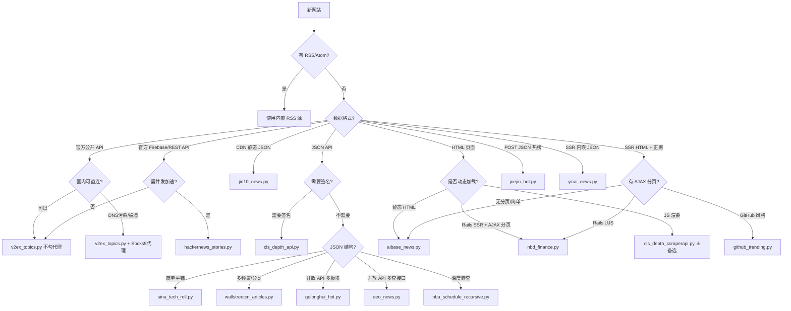

# 创建新闻源爬虫

## 概述
本 Skill 指导如何为新的新闻网站创建自定义爬虫 Provider，并提供**16个生产环境验证的成功案例**作为参考。

## 🔍 API 发现方法论（100% 成功率）

```
Step 1: 检查 RSS/Atom
  └─ 页面源码搜索 application/rss+xml，尝试 /feed /rss /atom.xml
  └─ 在 Feedly 搜索网站名称（知名网站通常已收录）
  └─ 有 → 直接用内置 RSS 源，不写代码

Step 2: 检查 SSR 内嵌数据
  └─ 搜索 __NEXT_DATA__（Next.js）或 __NUXT__（Nuxt.js）
  └─ 搜索 var xxx = [{...}] 形式的内嵌 JSON 数组（如 yicai.com 的 headList）

Step 3: 下载 JS chunk，搜索 API 路径 ⭐ 核心步骤
  └─ 用正则搜索: /api/ 、 /v1/ 、 /v2/ 、 cdn.xxx.com/json 等
  └─ 逐个 curl 验证，记录哪些需要签名、哪些完全开放

Step 4: 尝试常见 API 模式
  └─ CDN 静态 JSON、官方公开 API、已知域名猜测

Step 4.5: 检查 Rails/传统 SSR 站点
  └─ 查看 HTML 中是否有 data-remote="true"（Rails UJS AJAX）
  └─ 查看 "加载更多" 链接的 URL 模式（?last_article=xxx）
  └─ 有 → 直接解析 SSR HTML，参考 nbd_finance.py

Step 5: 如果有签名，从 JS 逆向破解
  └─ 搜索 "sign" 关键字，追踪 webpack module 依赖链
  └─ 还原算法：通常是参数排序拼接 → 某种 hash
```

### 关键经验

- **页面路径 ≠ API 参数**：wallstreetcn `/news/tmt` 对应 API 参数 `category=technology`
- **CDN JSON 最稳定**：jin10 有 reference-api 但 502，CDN JSON 反而最可靠
- **签名不一定复杂**：cls.cn 的签名就是 SHA-1 → MD5
- **大部分财经站 API 完全开放**：gelonghui、jin10、wallstreetcn、eeo.com.cn 都不需要认证
- **国内服务器 DNS 污染**：v2ex.com 等被墙网站需走代理
- **POST JSON API 也可能完全开放**：掘金热榜无需签名无需登录，POST 即可
- **API 能通不代表脚本能通**：Docker 容器内需确保代理环境变量正确传递
- **传统 Rails 站点无 JSON API**：nbd.com.cn 等老站用 SSR HTML + Rails UJS AJAX 分页，需正则解析
- **AJAX 分页返回 JS 片段**：Rails `data-remote="true"` 返回的是 `$(...).append('HTML')` 格式，需设 `X-Requested-With: XMLHttpRequest`
- **页面 JS 中藏着 API**：eeo.com.cn 首页 JS 中 `$.getJSON(appUrl + '/?app=article&...')` 暴露了完整 JSON API，比解析 HTML 高效得多
- **同站多套 API 模式**：eeo.com.cn 首页用 `synPage` action，频道页用 `getMoreArticle` + UUID，快讯用 `catid`，需分别处理
- **SSR 内嵌 JSON 数据量可能很大**：yicai.com 首页 HTML 约 1MB，其中 `var headList=[...]` 内嵌 300 条完整文章 JSON，无需额外 API 请求
- **内嵌 JSON 变量名不固定**：有的用 `var xxx = [...]`，有的用 `xxx=[...]`（无 var、无空格），正则需兼容两种写法


---

## 🎯 快速开始

### 决策流程




### 成功案例库（16个）

| 案例脚本 | 适用场景 | 关键技术 | 难度 |
|---------|---------|----------|------|
| [v2ex_topics.py](examples/v2ex_topics.py) | 官方公开 API + 代理 | DNS 污染需 Socks5 代理 | ⭐ |
| [jin10_news.py](examples/jin10_news.py) | CDN 静态 JSON | 无需认证 | ⭐ |
| [sina_tech_roll.py](examples/sina_tech_roll.py) | 简单 JSON API | 参数请求 | ⭐ |
| [juejin_hot.py](examples/juejin_hot.py) | POST JSON 热榜 | sort_type + hot_index 排序 | ⭐ |
| [eeo_news.py](examples/eeo_news.py) | 开放 JSON API 多套接口 | 首页/频道/快讯三套 API | ⭐ |
| [yicai_news.py](examples/yicai_news.py) | SSR 内嵌 JSON | 首页 HTML 内嵌 300 条 JSON、频道筛选 | ⭐ |
| [gelonghui_hot.py](examples/gelonghui_hot.py) | 开放 API 多板块 | 多 source 分支 | ⭐⭐ |
| [wallstreetcn_articles.py](examples/wallstreetcn_articles.py) | 多分类 API | 同域猜测、data_path 差异 | ⭐⭐ |
| [wallstreetcn_flash.py](examples/wallstreetcn_flash.py) | 多频道轮询 | 去重、排序 | ⭐⭐ |
| [aibase_news.py](examples/aibase_news.py) | 静态 HTML | BS4 + Regex | ⭐⭐ |
| [hackernews_stories.py](examples/hackernews_stories.py) | 官方 API + 并发 + 代理 | Firebase API、concurrent.futures | ⭐⭐ |
| [nbd_finance.py](examples/nbd_finance.py) | SSR HTML + AJAX 分页 | Rails UJS、正则解析、多频道 | ⭐⭐ |
| [github_trending.py](examples/github_trending.py) | SSR HTML + 正则 | GitHub 静态 HTML、代理 | ⭐⭐ |
| [nba_schedule_recursive.py](examples/nba_schedule_recursive.py) | 嵌套 JSON | 递归遍历 | ⭐⭐⭐ |
| [cls_depth_api.py](examples/cls_depth_api.py) | 签名 API | SHA-1 → MD5 签名破解 | ⭐⭐⭐ |
| [cls_depth_scraperapi.py](examples/cls_depth_scraperapi.py) | ⚠️ JS 渲染（备选） | ScraperAPI | ⭐⭐⭐ |

> 💡 `cls_depth_api.py` 已替代 `cls_depth_scraperapi.py`，优先使用直接 API 方案。

📖 **详细说明**: 查看 [examples/README.md](examples/README.md)


---

## 📝 创建步骤

### 1. 优先检查 RSS 🌟

**永远优先使用原生 RSS！** 脚本仅作为最后的备选方案。

检查方法：
1. 页面源码搜索 `application/rss+xml`，尝试 `/feed` `/rss` `/atom.xml` `/rss.xml`
2. 在 [Feedly](https://feedly.com) 搜索网站名称，知名网站通常已被 Feedly 收录，可直接获取 RSS 地址
3. 尝试 RSSHub（`https://rsshub.app/网站名`）等第三方 RSS 生成服务

有 RSS → 直接在 Admin 后台添加 RSS 订阅源，不需要写代码。

### 2. 分析目标网站 (No RSS)

按照「API 发现方法论」执行：
- [ ] 确保没有 RSS Feed
- [ ] 下载 JS chunk 文件，搜索 API 路径
- [ ] 逐个 curl 验证 API，记录是否需要签名
- [ ] 确定数据路径（JSON 中数据在哪个字段）

### 3. 编写爬虫代码

在 Admin 后台 → 自定义源管理中创建，核心接口：

```python
def fetch(config, context):
    """
    Args:
        config (dict): 配置参数
        context (dict): 上下文 { 'now', 'use_scraperapi', 'use_socks_proxy', 'platform_id' }
    Returns:
        list: [{"title": "标题", "url": "链接", "rank": 1, "published_at": 1705284000}]
    """
    return items
```

### 4. 测试并配置分类

在 Admin 后台点击"测试运行"验证，然后分配到合适的栏目分类。


---

## 🛠️ DynamicPyProvider 沙箱环境

### ✅ 允许的模块
- `requests`, `urllib` (网络请求)
- `bs4`, `lxml`, `html` (网页解析)
- `json`, `re`, `encodings` (数据处理)
- `datetime`, `time` (时间处理)
- `math`, `random`, `hashlib`, `base64` (基础算法)
- `collections`, `typing` (数据结构)
- `concurrent` (并发，如 `concurrent.futures.ThreadPoolExecutor`)
- `string`, `functools`, `itertools`, `operator` (工具函数)

### 🚫 禁止的模块
- `os`, `sys`, `subprocess`, `platform` (系统操作)
- `inspect`, `implib` (元编程)
- `eval()`, `exec()`, `compile()` 已从内置空间移除

### 特殊函数 `scraperapi_get()`

```python
# Socks5 代理（访问被墙网站）
use_socks = context.get("use_socks_proxy", False)
resp = scraperapi_get(url, use_socks_proxy=use_socks, timeout=15)

# ScraperAPI（JS 渲染，最后手段）
resp = scraperapi_get(url, use_scraperapi=True, scraperapi_params={"render": "true"}, timeout=60)
```

**代理不生效排查清单**：
- `HOTNEWS_SOCKS_PROXY` 是否在 compose 文件对应服务的 environment 中
- `docker/.env` 中是否设置了 `HOTNEWS_SOCKS_PROXY=http://宿主机网关:端口`
- 修改 `.env` 后是否 `docker compose up -d --force-recreate`（restart 不会重读 .env）
- 前端 JS 是否有浏览器缓存（需 Cmd+Shift+R 强制刷新）


---

## 💡 实战技巧

### 需要代理的网站（v2ex / hackernews）
```python
use_socks = context.get("use_socks_proxy", False)
resp = scraperapi_get(url, use_socks_proxy=use_socks, headers={"User-Agent": "Mozilla/5.0"}, timeout=15)
```

### 签名破解（cls.cn）
```python
import hashlib
def cls_sign(params):
    sorted_keys = sorted(params.keys(), key=lambda x: x.upper())
    parts = [f"{k}={params[k]}" for k in sorted_keys if params[k] is not None]
    sha1 = hashlib.sha1("&".join(parts).encode()).hexdigest()
    return hashlib.md5(sha1.encode()).hexdigest()
```

### POST JSON 热榜（掘金）
```python
import json, urllib.request
body = json.dumps({"id_type": 2, "sort_type": 3, "count": 30, "cursor": "0"}).encode()
req = urllib.request.Request(url, data=body, headers={"Content-Type": "application/json"}, method="POST")
with urllib.request.urlopen(req, timeout=15) as resp:
    data = json.loads(resp.read())
```

### 多 source 分支模式
```python
source = config.get("source", "hot")
if source == "hot":
    url, data_path = "https://example.com/api/hot", "day_items"
elif source == "latest":
    url, data_path = "https://example.com/api/latest", "items"
```

### 并发请求加速（hackernews）
```python
import concurrent.futures
with concurrent.futures.ThreadPoolExecutor(max_workers=10) as ex:
    raw_items = list(ex.map(get_item, ids))
```

### SSR HTML + 多频道分支（每经网）
```python
source_map = {
    "finance":    ("finance",  "119"),
    "regulation": ("finance",  "415"),
    "economy":    ("economy",  "129"),
}
subdomain, column_id = source_map[source]
url = f"https://{subdomain}.nbd.com.cn/columns/{column_id}/"
# 正则提取: <a href="URL" class="f-title">标题</a>
```

### GitHub 风格 HTML 正则解析
```python
articles = re.findall(r'<article class="Box-row">(.*?)</article>', raw, re.DOTALL)
for art in articles:
    h2 = re.search(r'<h2[^>]*>.*?<a[^>]*href="([^"]+)"', art, re.DOTALL)
```

### 同站多套 API（经济观察网）
```python
# 首页综合 API
url = base + "?app=article&controller=synPage&action=index_news"
params = {"page": 0, "size": 30}

# 频道 API (UUID 模式)
channel_map = {"finance": "9cdd41e11a114e5d8cbb8be12474aadd", ...}
url = base + "?app=article&controller=index&action=getMoreArticle"
params = {"uuid": channel_map[source], "page": 1, "pageSize": 20}

# 快讯 API (catid 模式)
params = {"catid": 3690, "page": 1, "pageSize": 20}
```

### SSR 内嵌 JSON 提取（第一财经）
```python
import re, json

# 首页 HTML 中内嵌 var headList=[{...}, ...]; 约 300 条
pattern = r'(?:var\s+)?headList\s*=\s*\['
m = re.search(pattern, html)
start = html.index('[', m.start())
# 括号匹配找到完整数组
depth = 0
for i in range(start, start + 800000):
    if html[i] == '[': depth += 1
    elif html[i] == ']':
        depth -= 1
        if depth == 0:
            data = json.loads(html[start:i+1])
            break
# 按 ChannelName 筛选频道，按 NewsType 过滤视频
articles = [d for d in data if d["NewsType"] != 12]
```

---

## ⚠️ 常见陷阱

| 问题 | 原因 | 解决方案 |
|------|------|----------|
| 返回空列表 | URL 或参数错误 | 浏览器中验证 API 响应 |
| 签名错误 | 参数排序或 hash 算法不对 | 从 JS 源码逆向 |
| 直连超时 | DNS 污染或 IP 被封 | `scraperapi_get(use_socks_proxy=True)` |
| 勾选代理仍返回 0 条 | 环境变量未注入容器 | 检查 compose + force-recreate |
| 测试运行代理不生效 | 前端未传 use_socks_proxy | Cmd+Shift+R 强制刷新 |
| JS 动态内容抓不到 | 需要浏览器渲染 | 优先找直接 API |

---

## 📚 参考信息

- [成功案例详解](examples/README.md) - 16 个生产案例的技术要点
- [DynamicPyProvider 源码](../../hotnews/kernel/providers/dynamic_py.py) - 沙箱实现细节
