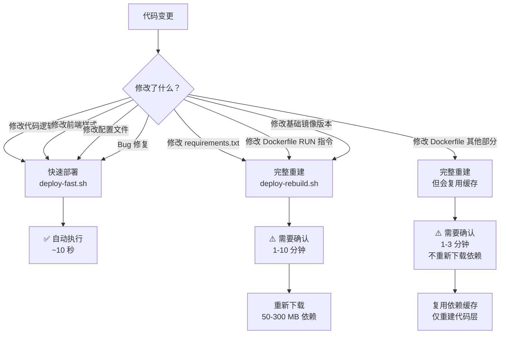

# 🚀 Hotnews 部署决策指南

## 快速决策流程图



## 📊 详细对比表

| 变更类型 | 使用脚本 | 需要确认？ | 是否重新下载依赖？ | 预计时间 |
|---------|---------|----------|-----------------|---------|
| 修改 `.py` 代码 | `deploy-fast.sh` | ❌ 自动执行 | ❌ 不下载 | ~10 秒 |
| 修改前端 HTML/CSS/JS | `deploy-fast.sh` | ❌ 自动执行 | ❌ 不下载 | ~10 秒 |
| 修改配置文件（非 Docker） | `deploy-fast.sh` | ❌ 自动执行 | ❌ 不下载 | ~10 秒 |
| **修改 `requirements.txt`** | `deploy-rebuild.sh` | ✅ **需确认** | ✅ **重新下载** | 1-10 分钟 |
| **修改 Dockerfile `RUN pip install`** | `deploy-rebuild.sh` | ✅ **需确认** | ✅ **重新下载** | 1-10 分钟 |
| **修改 Dockerfile `apt-get`** | `deploy-rebuild.sh` | ✅ **需确认** | ✅ **重新下载** | 1-10 分钟 |
| 修改 Dockerfile `ENV` | `deploy-rebuild.sh` | ✅ 需确认 | ❌ 不下载 | 1-3 分钟 |
| 修改 Dockerfile `CMD` | `deploy-rebuild.sh` | ✅ 需确认 | ❌ 不下载 | 1-3 分钟 |
| 修改基础镜像版本 | `deploy-rebuild.sh` | ✅ **需确认** | ✅ **重新下载** | 5-10 分钟 |

## 🎯 核心规则

### 自动执行（无需确认）
```yaml
条件:
  - 使用 deploy-fast.sh
  - 仅修改应用代码
  - 不涉及依赖或 Docker 配置
特点:
  - 有 // turbo-all 标记
  - AI 可以自动执行
  - 耗时约 10 秒
```

### 需要确认
```yaml
条件:
  - 使用 deploy-rebuild.sh
  - 修改了 requirements.txt 或 Dockerfile
关键问题:
  - "是否修改了 requirements.txt 或 Dockerfile 的 RUN 指令？"
  - 如果是 → 会重新下载依赖（50-300 MB）
  - 如果否，但修改了其他 Dockerfile 部分 → 不会重新下载，但需重建镜像
```

## 💡 实际例子

### ✅ 场景 1：修复了一个 Bug
```python
# 修改了 hotnews/kernel/providers/rss_provider.py
def parse_feed(url):
    # 修复了解析错误 ← 只改代码
    ...
```
**决策**: 使用 `deploy-fast.sh`，AI 自动执行 ✅

---

### ⚠️ 场景 2：添加新功能，需要新库
```bash
# 修改了 docker/requirements.viewer.txt
echo "scrapy>=2.11.0" >> docker/requirements.viewer.txt
```
**决策**: 使用 `deploy-rebuild.sh`，**必须用户确认** ⚠️  
**原因**: 会触发重新下载约 100 MB 依赖

---

### ⚠️ 场景 3：优化 pip 安装速度
```dockerfile
# Dockerfile 中修改
- RUN pip install -r requirements.txt
+ RUN pip install --upgrade pip && pip install -r requirements.txt
```
**决策**: 使用 `deploy-rebuild.sh`，**必须用户确认** ⚠️  
**原因**: RUN 指令变化，会破坏缓存，重新下载所有依赖

---

### ⚠️ 场景 4：修改环境变量
```dockerfile
# Dockerfile 中修改
- ENV VIEWER_WORKERS=2
+ ENV VIEWER_WORKERS=4
```
**决策**: 使用 `deploy-rebuild.sh`，需要用户确认 ⚠️  
**但是**: 不会重新下载依赖，仅重建镜像（1-3 分钟）

---

## 🔍 如何判断是否会重新下载依赖？

### 查看 Dockerfile 层的顺序

以 `Dockerfile.viewer` 为例：

```dockerfile
FROM python:3.10-slim                          # 层 1
WORKDIR /app                                    # 层 2
COPY docker/requirements.viewer.txt .          # 层 3 ← 依赖文件
RUN pip install -r requirements.viewer.txt     # 层 4 ← 安装依赖
# ══════════════════════════════════════════════════════════
#                    ↑ 分界线 ↑
# 修改这里之前的 → 会重新下载依赖
# 修改这里之后的 → 不会重新下载依赖
# ══════════════════════════════════════════════════════════
COPY hotnews/ ./hotnews/                       # 层 5 ← 应用代码
COPY mcp_server/ ./mcp_server/                 # 层 6
ENV PYTHONUNBUFFERED=1                          # 层 7
CMD ["python", "-m", "uvicorn", "..."]         # 层 8
```

### 判断规则

| 修改位置 | 影响层 | 是否重新下载依赖？ |
|---------|--------|-----------------|
| 层 1-4（分界线之前） | 破坏层 4 缓存 | ✅ **会重新下载** |
| 层 5-8（分界线之后） | 层 4 缓存仍有效 | ❌ 不会重新下载 |
| `requirements.txt` 内容 | 破坏层 3 缓存 | ✅ **会重新下载** |

## 📝 总结

**核心原则**：
1. **日常代码修改** → 快速部署（自动）
2. **修改 requirements.txt 或 Dockerfile RUN 指令** → 完整重建（**必须确认**）
3. **修改 Dockerfile 其他部分** → 完整重建（需确认，但可能不重新下载依赖）

AI 助手会根据这些规则决定是否需要向你确认！
