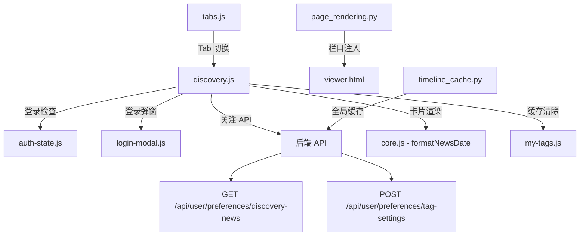

# 设计文档：新发现栏目

## 概述

"新发现"栏目展示 AI 发现的热门标签及其新闻，是一个公开栏目，无需登录即可查看。该功能复用"我的关注"栏目的实现模式，包括卡片渲染、缓存机制、Tab 切换等。

### 设计目标

1. **公开访问**：无需登录即可查看，降低用户门槛
2. **代码复用**：复用 my-tags.js 的实现模式，减少开发成本
3. **性能优化**：前后端双层缓存，10分钟 TTL
4. **一致体验**：与"我的关注"保持一致的卡片样式和交互

## 架构

### 整体架构

```
┌─────────────────────────────────────────────────────────────┐
│                        主页面 (viewer.html)                   │
├─────────────────────────────────────────────────────────────┤
│  Tab 栏: [我的关注] [✨新发现] [深入探索] [知识库] ...         │
├─────────────────────────────────────────────────────────────┤
│  ┌─────────────────────────────────────────────────────────┐│
│  │                    Discovery Tab 内容                    ││
│  │  ┌──────────┐ ┌──────────┐ ┌──────────┐ ┌──────────┐   ││
│  │  │ DeepSeek │ │ 春节档   │ │ 哪吒2    │ │ ...      │   ││
│  │  │ NEW      │ │ NEW      │ │ NEW      │ │          │   ││
│  │  │ 新闻1    │ │ 新闻1    │ │ 新闻1    │ │          │   ││
│  │  │ 新闻2    │ │ 新闻2    │ │ 新闻2    │ │          │   ││
│  │  │ ...      │ │ ...      │ │ ...      │ │          │   ││
│  │  └──────────┘ └──────────┘ └──────────┘ └──────────┘   ││
│  └─────────────────────────────────────────────────────────┘│
└─────────────────────────────────────────────────────────────┘
```

### 模块依赖



### 栏目注入流程

```
render_viewer_page()
    │
    ├── _inject_explore_category()     # 深入探索
    ├── _inject_my_tags_category()     # 我的关注
    └── _inject_discovery_category()   # ✨ 新发现 (新增)
```

## 组件与接口

### 1. Discovery 前端模块

**文件**: `hotnews/hotnews/web/static/js/src/discovery.js`

```javascript
// 常量
const DISCOVERY_CATEGORY_ID = 'discovery';
const DISCOVERY_CACHE_KEY = 'hotnews_discovery_cache';
const DISCOVERY_CACHE_TTL = 10 * 60 * 1000; // 10 minutes

// 状态
let discoveryLoaded = false;
let discoveryLoading = false;

// 公共接口
export function loadDiscovery(force = false);  // 加载数据
export function init();                         // 初始化模块
export function clearCache();                   // 清除缓存
export function handleTabSwitch(categoryId);    // Tab 切换处理
```

### 2. 后端 API

**文件**: `hotnews/hotnews/kernel/user/preferences_api.py`

```python
@router.get("/discovery-news")
async def get_discovery_news(
    request: Request,
    news_limit: int = Query(50, ge=1, le=100),  # 每个标签的新闻数量
    tag_limit: int = Query(30, ge=1, le=50),    # 最多返回的标签数量
):
    """获取新发现标签及其新闻（公开接口，无需登录）"""
```

### 3. API 接口

| API 端点 | 方法 | 用途 | 登录要求 |
|---------|------|------|---------|
| `/api/user/preferences/discovery-news` | GET | 获取新发现标签和新闻 | 否 |
| `/api/user/preferences/tag-settings` | POST | 关注标签 | 是 |

### 4. 栏目注入函数

**文件**: `hotnews/hotnews/web/page_rendering.py`

```python
def _inject_discovery_category(data: Dict[str, Any]) -> Dict[str, Any]:
    """Inject 'discovery' category after 'my-tags' (public, no auth required)."""
    try:
        cats = data.get("categories") if isinstance(data, dict) else None
        if not isinstance(cats, dict):
            return data
        if "discovery" in cats:
            return data

        discovery = {
            "id": "discovery",
            "name": "✨ 新发现",
            "icon": "✨",
            "platforms": {},
            "news_count": 0,
            "filtered_count": 0,
            "is_new": False,
            "requires_auth": False,  # 无需登录
            "is_dynamic": True,
        }
        
        # Insert after my-tags
        new_cats = {}
        for k, v in cats.items():
            new_cats[k] = v
            if k == "my-tags":
                new_cats["discovery"] = discovery
        if "discovery" not in new_cats:
            new_cats["discovery"] = discovery
        data["categories"] = new_cats
        return data
    except Exception:
        return data
```

### 5. 缓存实例

**文件**: `hotnews/hotnews/web/timeline_cache.py`

```python
# 新发现栏目缓存（全局共享，10分钟 TTL）
discovery_news_cache = TimelineCache(
    name="discovery_news",
    ttl_seconds=600,  # 10 minutes
)
```

## 数据模型

### API 响应结构

```javascript
{
    "ok": true,
    "tags": [
        {
            "tag": {
                "id": "deepseek",
                "name": "DeepSeek",
                "icon": "🏷️",
                "badge": "new",
                "first_seen_date": "01-25",
                "occurrence_count": 15,
                "confidence": 0.92,
                "is_candidate": true
            },
            "news": [
                {
                    "id": "xxx",
                    "title": "DeepSeek发布新模型...",
                    "url": "https://...",
                    "published_at": 1706428800,
                    "source_id": "36kr"
                }
            ],
            "count": 50
        }
    ],
    "cached": true,
    "cache_age": 120.5
}
```

### 前端缓存结构

```javascript
// localStorage: hotnews_discovery_cache
{
    "tags": [...],           // 标签数据
    "timestamp": 1706428800  // 缓存时间戳
}
```

### 卡片 HTML 结构

```html
<div class="platform-card discovery-card" data-tag-id="deepseek" data-candidate="true">
    <div class="platform-header">
        <div class="platform-name">
            🏷️ DeepSeek
            <span class="discovery-badge">NEW</span>
            <span class="discovery-date">发现于 01-25</span>
            <span class="discovery-count">(15条)</span>
        </div>
        <div class="platform-header-actions"></div>
    </div>
    <ul class="news-list">
        <li class="news-item" data-news-id="xxx">
            <div class="news-item-content">
                <span class="news-index">1</span>
                <a class="news-title" href="..." target="_blank">新闻标题</a>
                <span class="news-ai-indicator"></span>
                <div class="news-actions">
                    <span class="tr-news-date">01-25</span>
                    <button class="news-summary-btn"></button>
                </div>
            </div>
        </li>
        <!-- ... 更多新闻 -->
    </ul>
</div>
```

## 正确性属性

### Property 1: 无需登录访问

*对于任意* 用户访问状态（已登录或未登录），Discovery_Tab 的数据加载和渲染应该正常工作，不应该因为未登录而阻止访问。

**Validates: Requirements 1.3**

### Property 2: 缓存有效性

*对于任意* 缓存数据和当前时间，如果缓存时间戳距离当前时间超过 10 分钟，则缓存应该被判定为无效，系统应该重新获取数据。

**Validates: Requirements 5.1, 5.2, 5.3**

### Property 3: 标签排序正确性

*对于任意* 标签列表，渲染后的卡片顺序应该按照 occurrence_count 降序排列。

**Validates: Requirements 2.5**

### Property 4: 新闻数量限制

*对于任意* 标签卡片，其新闻列表的数量不应超过 50 条。

**Validates: Requirements 2.4**

### Property 5: 关注状态同步

*对于任意* 关注操作，成功后应该清除 my-tags 的前端缓存，确保"我的关注"栏目能显示新关注的标签。

**Validates: Requirements 4.6**

### Property 6: 晋升标准一致性

*对于任意* 显示在 Discovery_Tab 中的标签，其属性应该满足至少一个晋升标准条件。

**Validates: Requirements 6.1**

## 错误处理

### API 错误处理

```javascript
async function handleApiError(error, context) {
    console.error(`[Discovery] ${context}:`, error);
    
    // 网络错误
    if (!error.status) {
        showError('网络连接失败，请检查网络');
        return;
    }
    
    // 服务器错误
    if (error.status >= 500) {
        showError('服务器繁忙，请稍后重试');
        return;
    }
    
    // 其他错误
    showError(error.message || '加载失败，请重试');
}
```

### 关注操作错误处理

```javascript
async function handleFollowError(error, tagId) {
    if (error.status === 401) {
        // 未登录，弹出登录框
        openLoginModal();
        return;
    }
    
    showToast('关注失败，请重试');
}
```

## 测试策略

### 单元测试

1. **缓存逻辑测试**
   - 缓存有效性判断
   - 缓存读写操作
   - 缓存清除操作

2. **数据处理测试**
   - 标签排序函数
   - 新闻列表截断
   - 日期格式化

3. **状态管理测试**
   - 加载状态切换
   - 错误状态处理

### 属性测试

使用 fast-check 进行属性测试：

```javascript
// Property 3: 标签排序正确性
fc.assert(
    fc.property(
        fc.array(tagArbitrary),
        (tags) => {
            const sorted = sortByOccurrence(tags);
            for (let i = 1; i < sorted.length; i++) {
                if (sorted[i].occurrence_count > sorted[i-1].occurrence_count) {
                    return false;
                }
            }
            return true;
        }
    ),
    { numRuns: 100 }
);
```

### 集成测试

1. **Tab 切换测试**
   - 切换到 Discovery Tab 触发数据加载
   - 切换离开后再切回保持状态

2. **关注流程测试**
   - 未登录关注弹出登录框
   - 已登录关注成功更新状态

## 与"我的关注"的对比

| 对比项 | 我的关注 (my-tags.js) | 新发现 (discovery.js) |
|--------|----------------------|----------------------|
| 数据来源 | 用户关注的 tag_id | tag_candidates 中的 NEW 标签 |
| 登录检查 | `checkAuth()` 必须登录 | 无需登录 |
| API 端点 | `/api/user/preferences/followed-news` | `/api/user/preferences/discovery-news` |
| 缓存 key | `hotnews_my_tags_cache` | `hotnews_discovery_cache` |
| 缓存 TTL | 5 分钟 | 10 分钟 |
| 右键菜单 | 取消关注 | 一键关注 |
| 卡片标记 | 无 | NEW 徽章 + 发现日期 |
| 每卡新闻数 | 10 条 | 50 条 |
| 最大卡片数 | 按用户关注 | 30 个 |
