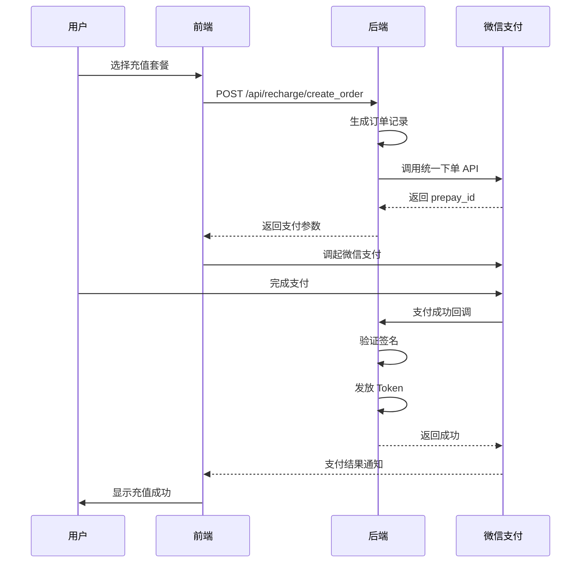

# Token 充值系统 - 微信支付集成实现方案

## 项目目标

为 HotNews 项目实现基于**微信支付**的 Token 充值系统，支持用户通过微信支付购买 Token，用于 AI 摘要功能的使用。

## 用户需求确认

> [!IMPORTANT]
> 在开始实现前，需要用户提供以下信息：

### 1. 支付方式选择
- **你选择哪种微信支付方式？**
  - JSAPI 支付（微信内网页支付，用户体验最佳）
  - H5 支付（手机浏览器外支付）
  - Native 支付（PC 扫码支付）
  - 建议：如果有公众号，优先使用 JSAPI

### 2. 商户信息
- **微信商户号（mchid）**：
- **API 密钥（API Key）**：在商户平台获取
- **API 证书**：需要下载证书文件（cert.pem 和 key.pem）
- **公众号 AppID**（如使用 JSAPI）：

### 3. Token 计费规则
- **充值档位设计**：
  ```
  示例：
  - ¥10 = 10,000 Token
  - ¥50 = 60,000 Token（送 10,000）
  - ¥100 = 150,000 Token（送 50,000）
  ```
  
- **AI 摘要消耗规则**：
  - 每次摘要消耗多少 Token？（建议：100-500 Token/次）

### 4. 回调地址
- **支付成功回调 URL**：
  - 格式：`https://yourdomain.com/api/payment/wechat/callback`
  - 需要在微信商户平台配置此 URL

---

## 技术方案设计

### 数据库架构

#### 新增表

##### 1. `recharge_packages` - 充值套餐配置
```sql
CREATE TABLE recharge_packages (
    id INTEGER PRIMARY KEY AUTOINCREMENT,
    name TEXT NOT NULL,                    -- 套餐名称，如 "基础套餐"
    price_cents INTEGER NOT NULL,          -- 价格（分），如 1000 = ¥10
    token_amount INTEGER NOT NULL,         -- 获得的 Token 数量
    bonus_tokens INTEGER DEFAULT 0,        -- 赠送的额外 Token
    display_tag TEXT DEFAULT '',           -- 显示标签，如 "最超值"
    sort_order INTEGER DEFAULT 0,          -- 排序
    enabled INTEGER DEFAULT 1,             -- 是否启用
    created_at INTEGER NOT NULL,
    updated_at INTEGER NOT NULL
);
```

##### 2. `recharge_orders` - 充值订单
```sql
CREATE TABLE recharge_orders (
    id TEXT PRIMARY KEY,                   -- 订单号
    user_id INTEGER NOT NULL,              -- 用户 ID
    package_id INTEGER,                    -- 套餐 ID
    amount_cents INTEGER NOT NULL,         -- 支付金额（分）
    token_amount INTEGER NOT NULL,         -- Token 数量
    payment_method TEXT NOT NULL,          -- 支付方式：wechat/alipay
    payment_channel TEXT DEFAULT '',       -- 支付渠道：jsapi/h5/native
    status TEXT DEFAULT 'pending',         -- pending/paid/cancelled/refunded
    transaction_id TEXT DEFAULT '',        -- 微信交易号
    prepay_id TEXT DEFAULT '',             -- 预支付 ID
    created_at INTEGER NOT NULL,
    paid_at INTEGER DEFAULT 0,             -- 支付完成时间
    cancelled_at INTEGER DEFAULT 0,
    refunded_at INTEGER DEFAULT 0,
    callback_data TEXT DEFAULT '{}',       -- 回调原始数据
    FOREIGN KEY (user_id) REFERENCES users(id)
);

CREATE INDEX idx_recharge_orders_user ON recharge_orders(user_id);
CREATE INDEX idx_recharge_orders_status ON recharge_orders(status);
```

##### 3. `token_transactions` - Token 交易记录
```sql
CREATE TABLE token_transactions (
    id INTEGER PRIMARY KEY AUTOINCREMENT,
    user_id INTEGER NOT NULL,
    transaction_type TEXT NOT NULL,        -- recharge/consume/refund/admin_adjust
    amount INTEGER NOT NULL,               -- 正数为充值，负数为消耗
    balance_before INTEGER NOT NULL,       -- 交易前余额
    balance_after INTEGER NOT NULL,        -- 交易后余额
    related_order_id TEXT DEFAULT '',      -- 关联订单号
    description TEXT DEFAULT '',           -- 描述
    created_at INTEGER NOT NULL,
    FOREIGN KEY (user_id) REFERENCES users(id)
);

CREATE INDEX idx_token_transactions_user ON token_transactions(user_id);
CREATE INDEX idx_token_transactions_type ON token_transactions(transaction_type);
```

---

### 后端 API 设计

#### 支付网关抽象层
```python
# hotnews/web/payment/gateway.py

class PaymentGateway:
    """支付网关抽象基类"""
    
    def create_order(self, order_id: str, amount_cents: int, description: str, **kwargs) -> dict:
        """创建支付订单"""
        raise NotImplementedError
    
    def verify_callback(self, request_data: dict) -> dict:
        """验证支付回调"""
        raise NotImplementedError
    
    def query_order(self, order_id: str) -> dict:
        """查询订单状态"""
        raise NotImplementedError
```

#### 微信支付实现
```python
# hotnews/web/payment/wechat_gateway.py

class WechatPayGateway(PaymentGateway):
    """微信支付网关"""
    
    def __init__(self, appid: str, mchid: str, api_key: str, cert_path: str, key_path: str):
        self.appid = appid
        self.mchid = mchid
        self.api_key = api_key
        # 初始化微信 SDK
    
    def create_jsapi_order(self, order_id: str, amount_cents: int, openid: str, description: str) -> dict:
        """创建 JSAPI 支付订单"""
        # 调用微信统一下单 API
        pass
```

---

### API 端点

#### 1. 获取充值套餐列表
```
GET /api/recharge/packages
Response:
{
  "packages": [
    {
      "id": 1,
      "name": "基础套餐",
      "price": 10.00,
      "token_amount": 10000,
      "bonus_tokens": 0,
      "display_tag": ""
    }
  ]
}
```

#### 2. 创建充值订单
```
POST /api/recharge/create_order
Body: {
  "package_id": 1,
  "payment_method": "wechat",
  "payment_channel": "jsapi"
}
Response:
{
  "order_id": "ORDER_20260122_xxx",
  "payment_data": {
    "appId": "xxx",
    "timeStamp": "xxx",
    "nonceStr": "xxx",
    "package": "prepay_id=xxx",
    "signType": "RSA",
    "paySign": "xxx"
  }
}
```

#### 3. 支付回调处理
```
POST /api/payment/wechat/callback
（由微信服务器调用）
```

#### 4. 查询充值记录
```
GET /api/recharge/history?page=1&pageSize=10
Response:
{
  "records": [
    {
      "order_id": "xxx",
      "amount": 10.00,
      "token_amount": 10000,
      "status": "paid",
      "created_at": 1234567890,
      "paid_at": 1234567900
    }
  ]
}
```

#### 5. 查询 Token 余额
```
GET /api/user/token_balance
Response:
{
  "balance": 50000,
  "used": 10000
}
```

---

### 前端设计

#### 充值页面
```
/recharge.html
- 套餐卡片展示
- 支付方式选择
- 确认支付按钮
```

#### 充值记录页面
```
/recharge/history.html
- 订单列表
- 状态筛选
- 分页
```

---

### 支付流程



---

## 验证计划

### 开发环境测试
1. 使用微信支付沙箱环境测试
2. 验证订单创建流程
3. 验证支付回调处理
4. 验证 Token 发放逻辑

### 生产环境部署
1. 配置真实商户信息
2. 配置回调 URL（需要 HTTPS）
3. 在微信商户平台设置回调地址白名单
4. 小金额测试（¥0.01）

---

## 下一步行动

1. **用户提供商户信息和计费规则**
2. **选择支付方式**（JSAPI/H5/Native）
3. **开始实现数据库和后端 API**
4. **创建前端充值界面**
5. **测试和部署**
