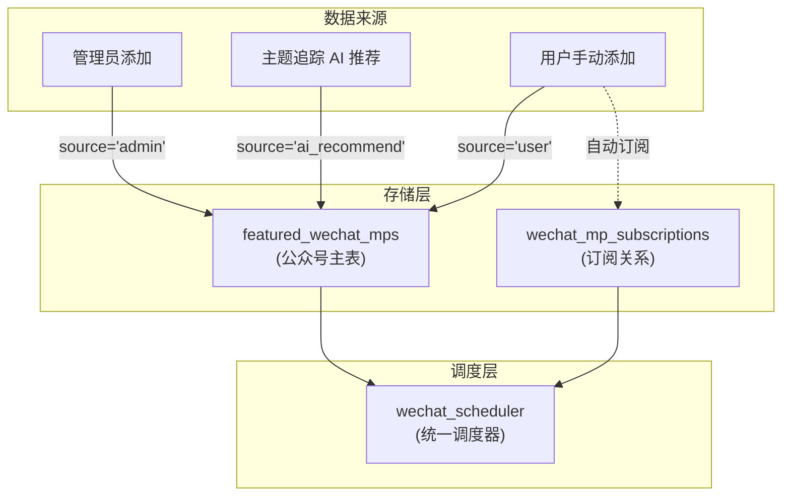
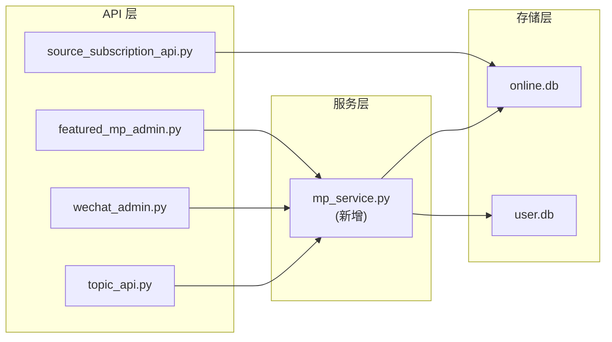

# 公众号存储架构重构 - 设计文档

## Overview

本设计文档描述公众号存储架构的重构方案，将分散在三个表中的公众号数据统一到 `featured_wechat_mps` 表，实现单一数据源、简化订阅逻辑、确保所有公众号都能被调度器抓取。

### 当前架构问题

```
┌─────────────────────────────────────────────────────────────────┐
│                        当前数据分布                              │
├─────────────────────────────────────────────────────────────────┤
│  featured_wechat_mps (在线库)                                    │
│  └── 管理员精选公众号                                            │
│                                                                  │
│  wechat_mp_subscriptions (用户库)                                │
│  └── 用户订阅的公众号                                            │
│                                                                  │
│  rss_sources (在线库, category='wechat_mp')                      │
│  └── 主题追踪 AI 推荐的公众号 ← 问题：调度器不读取此表            │
└─────────────────────────────────────────────────────────────────┘
```

**调度器数据来源** (mp_unified_list.py):
- `featured_wechat_mps` (enabled=1) - 优先级高
- `wechat_mp_subscriptions` - 优先级低，去重
- ❌ `rss_sources` - **不读取**，导致 AI 推荐的公众号无法被抓取

### 目标架构

```
┌─────────────────────────────────────────────────────────────────┐
│                        目标数据分布                              │
├─────────────────────────────────────────────────────────────────┤
│  featured_wechat_mps (在线库) - 公众号主表                       │
│  ├── source='admin'       管理员精选                             │
│  ├── source='ai_recommend' AI 推荐                               │
│  └── source='user'        用户添加                               │
│                                                                  │
│  wechat_mp_subscriptions (用户库)                                │
│  └── 用户订阅关系（引用 featured_wechat_mps.fakeid）             │
│                                                                  │
│  rss_sources (在线库)                                            │
│  └── 仅 RSS 源，不再存储公众号                                   │
└─────────────────────────────────────────────────────────────────┘
```

## Architecture

### 数据流架构



### 模块依赖关系



## Components and Interfaces

### 1. 数据库表结构变更

#### featured_wechat_mps 表扩展

```sql
-- 新增字段
ALTER TABLE featured_wechat_mps ADD COLUMN source TEXT DEFAULT 'admin';
-- 可选值: 'admin', 'ai_recommend', 'user'

ALTER TABLE featured_wechat_mps ADD COLUMN added_by_user_id INTEGER;
-- 用户添加时记录 user_id，其他来源为 NULL
```

### 2. 公众号服务模块 (新增)

创建 `hotnews/hotnews/kernel/services/mp_service.py`，封装公众号的增删改查逻辑：

```python
class MPService:
    """公众号服务 - 统一管理公众号数据"""
    
    def get_or_create_mp(
        self,
        fakeid: str,
        nickname: str,
        source: str,  # 'admin' | 'ai_recommend' | 'user'
        added_by_user_id: Optional[int] = None,
        round_head_img: str = "",
        signature: str = "",
    ) -> Dict[str, Any]:
        """
        获取或创建公众号记录
        
        如果公众号已存在，返回现有记录
        如果不存在，创建新记录并返回
        
        Returns:
            {"id": int, "fakeid": str, "nickname": str, "is_new": bool}
        """
        pass
    
    def get_mp_by_fakeid(self, fakeid: str) -> Optional[Dict[str, Any]]:
        """根据 fakeid 获取公众号"""
        pass
    
    def get_mp_by_nickname(self, nickname: str) -> Optional[Dict[str, Any]]:
        """根据昵称获取公众号（用于 AI 推荐时查重）"""
        pass
    
    def list_mps(
        self,
        source: Optional[str] = None,
        enabled: Optional[bool] = None,
        limit: int = 100,
    ) -> List[Dict[str, Any]]:
        """列出公众号"""
        pass
```

### 3. API 接口变更

#### topic_api.py - 主题追踪

修改 `_create_wechat_mp_source()` 函数：

```python
# 旧实现：写入 rss_sources
def _create_wechat_mp_source(conn, name, wechat_id, description):
    mp_url = f"wechat://mp/{wechat_id}"
    conn.execute(
        "INSERT INTO rss_sources ... VALUES (..., 'wechat_mp', ...)"
    )

# 新实现：写入 featured_wechat_mps
def _create_wechat_mp_source(conn, name, wechat_id, description):
    from hotnews.kernel.services.mp_service import MPService
    
    service = MPService(conn)
    result = service.get_or_create_mp(
        fakeid=wechat_id,  # 注意：AI 推荐时可能只有 wechat_id，需要搜索获取 fakeid
        nickname=name,
        source='ai_recommend',
    )
    return {
        "id": f"mp-{result['fakeid']}",
        "name": name,
        "type": "wechat_mp",
        "wechat_id": wechat_id,
        "status": "created" if result["is_new"] else "exists"
    }
```

#### source_subscription_api.py - 订阅源 API

已完成过滤 `category='wechat_mp'`，无需修改。

#### wechat_admin.py - 用户订阅

用户订阅公众号时，确保公众号存在于 `featured_wechat_mps`：

```python
async def subscribe(request: Request, body: SubscribeRequest):
    # 1. 确保公众号在主表中存在
    service = MPService(online_conn)
    service.get_or_create_mp(
        fakeid=body.fakeid,
        nickname=body.nickname,
        source='user',
        added_by_user_id=user_id,
        round_head_img=body.round_head_img,
        signature=body.signature,
    )
    
    # 2. 创建订阅关系（现有逻辑）
    user_conn.execute(
        "INSERT INTO wechat_mp_subscriptions ..."
    )
```

### 4. 数据迁移脚本

创建 `hotnews/scripts/migrate_wechat_mp_sources.py`：

```python
def migrate_wechat_mp_from_rss_sources(online_conn):
    """
    将 rss_sources 中的公众号数据迁移到 featured_wechat_mps
    
    迁移逻辑：
    1. 查询 rss_sources WHERE category='wechat_mp'
    2. 解析 url (wechat://mp/{wechat_id}) 获取 wechat_id
    3. 插入 featured_wechat_mps (source='ai_recommend')
    4. 记录迁移日志
    5. 删除 rss_sources 中的公众号数据
    """
    pass

def rollback_migration(online_conn, migration_log_path):
    """回滚迁移"""
    pass
```

## Data Models

### featured_wechat_mps 表结构

| 字段 | 类型 | 说明 |
|------|------|------|
| id | INTEGER | 主键，自增 |
| fakeid | TEXT | 公众号唯一标识，UNIQUE |
| nickname | TEXT | 公众号名称 |
| round_head_img | TEXT | 头像 URL |
| signature | TEXT | 简介 |
| category | TEXT | 分类 |
| sort_order | INTEGER | 排序 |
| enabled | INTEGER | 是否启用 (0/1) |
| article_count | INTEGER | 抓取文章数量 |
| last_fetch_at | INTEGER | 最后抓取时间 |
| **source** | TEXT | **新增：来源 (admin/ai_recommend/user)** |
| **added_by_user_id** | INTEGER | **新增：添加者 user_id** |
| created_at | INTEGER | 创建时间 |
| updated_at | INTEGER | 更新时间 |

### 来源类型说明

| source 值 | 说明 | added_by_user_id |
|-----------|------|------------------|
| admin | 管理员通过后台添加 | NULL |
| ai_recommend | 主题追踪 AI 推荐 | NULL |
| user | 用户手动添加 | 用户 ID |

## Correctness Properties

*A property is a characteristic or behavior that should hold true across all valid executions of a system—essentially, a formal statement about what the system should do. Properties serve as the bridge between human-readable specifications and machine-verifiable correctness guarantees.*


### Property 1: 公众号创建统一写入主表

*For any* 公众号创建操作（无论来源是管理员、AI 推荐还是用户），创建后查询 `featured_wechat_mps` 表应该能找到该公众号记录。

**Validates: Requirements 1.1, 2.1, 3.1**

### Property 2: source 字段正确标记来源

*For any* 新创建的公众号记录，其 `source` 字段值应该与创建时指定的来源一致：
- 管理员添加 → source='admin'
- AI 推荐 → source='ai_recommend'  
- 用户添加 → source='user'

**Validates: Requirements 1.2, 2.1, 3.1**

### Property 3: added_by_user_id 数据完整性

*For any* 公众号记录：
- 当 source='user' 时，added_by_user_id 应该是有效的用户 ID（非 NULL）
- 当 source='admin' 或 source='ai_recommend' 时，added_by_user_id 应该为 NULL

**Validates: Requirements 1.3, 3.2**

### Property 4: 公众号不重复创建（幂等性）

*For any* 已存在的公众号（相同 fakeid），再次调用创建操作应该返回已存在的记录，而不是创建新记录。数据库中同一 fakeid 的记录数量始终为 1。

**Validates: Requirements 2.3**

### Property 5: AI 推荐公众号默认启用

*For any* source='ai_recommend' 的公众号记录，其 enabled 字段应该为 1，确保可被调度器抓取。

**Validates: Requirements 2.2**

### Property 6: 用户添加后自动订阅

*For any* 用户添加公众号操作，完成后 `wechat_mp_subscriptions` 表中应该存在该用户对该公众号的订阅记录。

**Validates: Requirements 3.3**

### Property 7: 迁移数据完整性（Round-trip）

*For any* 迁移前存在于 `rss_sources` 中的公众号数据（category='wechat_mp'），迁移后应该能在 `featured_wechat_mps` 中找到对应记录，且关键字段（name/nickname, wechat_id/fakeid）保持一致。

**Validates: Requirements 5.1**

## Error Handling

### 1. 公众号创建失败

| 错误场景 | 处理方式 |
|----------|----------|
| fakeid 为空 | 返回 400 错误，提示 "fakeid 不能为空" |
| nickname 为空 | 返回 400 错误，提示 "公众号名称不能为空" |
| 数据库写入失败 | 返回 500 错误，记录日志，事务回滚 |
| source 值无效 | 返回 400 错误，提示 "无效的来源类型" |

### 2. 迁移失败

| 错误场景 | 处理方式 |
|----------|----------|
| 目标表已存在同 fakeid 记录 | 跳过该记录，记录日志 |
| 数据库连接失败 | 终止迁移，记录错误日志 |
| 部分数据迁移失败 | 事务回滚，输出失败记录列表 |

### 3. API 错误处理

```python
# 统一错误响应格式
{
    "ok": False,
    "error": "错误描述",
    "error_code": "ERROR_CODE"  # 可选
}
```

## Testing Strategy

### 单元测试

1. **MPService 测试**
   - `test_get_or_create_mp_new`: 创建新公众号
   - `test_get_or_create_mp_existing`: 获取已存在公众号
   - `test_source_field_values`: 验证 source 字段值
   - `test_added_by_user_id_integrity`: 验证 added_by_user_id 数据完整性

2. **API 测试**
   - `test_topic_api_creates_mp_in_featured_table`: 主题追踪创建公众号
   - `test_subscribe_creates_mp_if_not_exists`: 订阅时创建公众号
   - `test_sources_api_excludes_wechat_mp`: 订阅源 API 不返回公众号

3. **迁移脚本测试**
   - `test_migration_transfers_all_records`: 迁移所有记录
   - `test_migration_handles_duplicates`: 处理重复记录
   - `test_rollback_restores_data`: 回滚恢复数据

### 属性测试

使用 `hypothesis` 库进行属性测试，每个属性测试运行至少 100 次迭代。

```python
# 测试标签格式
# Feature: wechat-mp-storage-refactor, Property N: {property_text}

from hypothesis import given, strategies as st

@given(
    fakeid=st.text(min_size=1, max_size=50),
    nickname=st.text(min_size=1, max_size=100),
    source=st.sampled_from(['admin', 'ai_recommend', 'user']),
)
def test_property_1_mp_creation_writes_to_main_table(fakeid, nickname, source):
    """Feature: wechat-mp-storage-refactor, Property 1: 公众号创建统一写入主表"""
    # 创建公众号
    service.get_or_create_mp(fakeid=fakeid, nickname=nickname, source=source)
    # 验证能在主表中找到
    mp = service.get_mp_by_fakeid(fakeid)
    assert mp is not None
    assert mp['fakeid'] == fakeid
```

### 集成测试

1. **端到端流程测试**
   - 主题追踪推荐公众号 → 调度器抓取文章
   - 用户添加公众号 → 自动订阅 → 调度器抓取文章

2. **迁移测试**
   - 在测试数据库中执行完整迁移流程
   - 验证迁移前后数据一致性

### 测试数据

```python
# 测试用公众号数据
TEST_MPS = [
    {"fakeid": "test_fakeid_1", "nickname": "测试公众号1", "source": "admin"},
    {"fakeid": "test_fakeid_2", "nickname": "测试公众号2", "source": "ai_recommend"},
    {"fakeid": "test_fakeid_3", "nickname": "测试公众号3", "source": "user", "added_by_user_id": 1},
]
```
